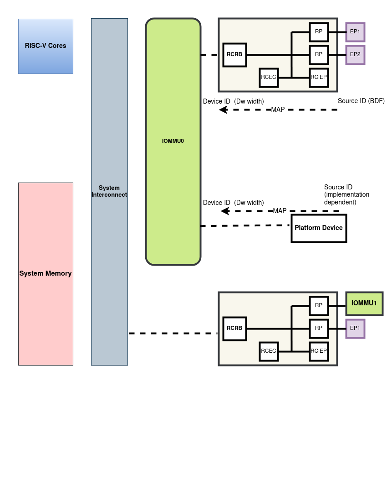

= RISC-V IO Mapping Table (RIMT)
[.text-center]
*RISC-V IO Mapping Table (RIMT)*

[.text-center]
#*_DRAFT FOR REVIEW_*#

This is a proposal for an ACPI representation of the relationship between
IO devices and RISC-V IOMMU.

The RISC-V IOMMU specificaiton defines an IOMMU for RISC-V platforms
which can be a regular platform device or a PCI device connected to
the host root port.

The RISC-V IOMMU provides two stage translation, device directory table,
command queue and fault reporting as wired interrupt or MSIx event for
both PCI and platform devices.

The RISC-V IO Mapping Table (RIMT)  provides information about the RISC-V
IOMMU and the relationship between the IO topology and the IOMMU.

.RISC-V IO Mapping Table (RIMT)
[cols="2,1,1,4", width=95%, align="center", options="header"]
|===
|*Field*|*Byte Length*|*Byte Offset*|*Description*

|- Signature|4|0|'RIMT' signature for the RISC-V IO Mapping Table
|- Length|4|4|The length of the table, in bytes, of the entire RIMT
|- Revision|1|8|The revision of the structure corresponding to the signature
field for this table. For the RIMT confirming this revision of the
specification, the revision is 1.
|- Checksum|1|9|The entire table must sum to zero
|- OEMID|6|10|
|- OEM Table ID|8|16|
|- OEM Revision|4|24|
|- Creator ID|4|28|
|- Creator Revision|4|32|
|- Number of RIMT devices|4|36| Number of nodes in RIMT device arrary
|- Offset to RIMT device array|4|40| The offset from start of this table to the
RIMT device array
|- Reserved | 4 | 44| Must be zero
|- RIMT device array |-|40|List of RIMT Devices. The list will contain all of
the structures from RIMT Device Types needed to support this platform. These
devices are defined in the following sections. See RIMT Device Structure
Types Table (Table 2).
|===

.RIMT Device Structure Types
|===
|*Value*|*Description*
|0| RISC-V IOMMU device structure. See Table 3
|1| PCI Root Complex device binding structure. See Table 5
|2| Platform device binding structure. See Table 7
|3-255| Reserved
|===

The IOMMU can be implemented as a regular platform device or as a device
connected to PCIe Root Port. 

.RISC-V IOMMU Device Structure
[cols="2,1,1,4", width=95%, align="center", options="header"]
|===
|*Field*|*Byte Length*|*Byte Offset*|*Description*
|Type | 1| 0| 0 -  RISC-V IOMMU device structure
|Revision | 1| 1| 1 - Revision of this RISC-V IOMMU device structure
|Length | 2| 2| The length of this structure (32 + 8 * N)
|ID | 2| 4| Unique ID of this IOMMU
|Model | 2 | 6| 0 - Generic RISC-V IOMMU

All other values are reserved
|IOMMU Base Address | 8 | 8| Base address where IOMMU registers are mapped. Valid only for memory
mapped IOMMU. If IOMMU is a PCI device, the BAR will be the mapped address of IOMMU registers.
|Flags | 4 | 16
a| 

* Bit 0: IOMMU is a PCI device
** 1: The IOMMU is implemented as a PCI device
** 0: The IOMMU is implemented as a memory mapped  device

* Bit 1: Proximity Domain valid
** 1: The Proximity Domain field has a valid value. 
** 0: The Proximity Domain field has no valid value. 

* Bit [31-2]: Reserved, must be zero

|PCI Segment number| 2 | 20| Valid only if IOMMU is implemented as a PCI device
|PCI B/D/F | 2 | 22| Bus/Device/Function encoded if IOMMU is implemented as a PCI device.
This field is valid only if the Flags field indicates it. Otherwise should be ignored.
|Proximity Domain | 4 | 24 | The Proximity Domain to which this IOMMU belongs. This is valid
only when the "Proximity Domain Valid" flag is set
|Number of wired interrupts | 2 | 28| Number of wired interrupts in the interrupts array.
This can be zero if MSI is supported.
|Wired Interrupts Offset | 2| 30| The offset from ths start of this device to the start
of the wired interrupt array. A value of 0 represents only MSIs are supported.
4+|List of wired interrupts.
| Wired Interrupts Array | 8 * N | - | Array of wired interrupt structures. See Table 4.
|===

.Wired Interrupts Structure
[cols="2,1,1,4", width=95%, align="center", options="header"]
|===
|*Field*|*Byte Length*|*Byte Offset*|*Description*
|Interrupt Number | 4 | 0| Wired interrupt number
|Flags | 2 | 4
a| 

* Bit 0: Interrupt Mode
** 0: Edge Triggerred.
** 1: Level Triggerred.

* Bit 1: Interrupt Polarity
** 0: Active Low
** 1: Active High

* Bit [31-2]: Reserved, must be zero

|APLIC ID| 2 | 6| Target APLIC. Should match with the APLIC ID in MADT and _MAT. 
|===

This table provides relationship between the PCI Root Complex Devices and IOMMU.

.PCI Root Complex Device Binding Structure
[cols="2,1,1,4", width=95%, align="center", options="header"]
|===
|*Field*|*Byte Length*|*Byte Offset*|*Description*
|Type | 1| 0| 1 -  PCI Root Complex device structure 
|Revision | 1| 1| 1 - Revision of this structure
|Length | 2| 2| The length of this structure (20 + 16 * N)
|ID | 2| 4| Unique ID. It can be simply the array index in the RIMT devices array.
|Reserved | 2 | 6| Must be zero
| Flags | 4 | 8
a| 

* Bit 0: ATS support
** 0: ATS is not supported in this root complex
** 1: ATS supported in this root complex

* Bit 1: PRI support
** 0: PRI is not supported in this root complex
** 1: PRI is supported in this root complex

* Bit [31-2]: Reserved, must be zero
|PCI Segment number| 2 | 12| Should match with _SEG method and MCFG.
|Mapping Array Offset | 2| 14| The offset from ths start of this device to the start of
the ID mapping array
| Number of mappings | 2 | 16| Number of mappings in the ID mapping array
|Reserved | 2 | 18| Must be zero
4+|List of ID mappings
| ID Mapping Array | 16 * N | - | Array of ID Mapping structures. See ID Mapping Structure (Table 6).
|===

The ID mapping structure provides information on how devices are
connected to an IOMMU.

.ID Mapping structure
[cols="2,1,1,4", width=95%, align="center", options="header"]
|===
|*Field*|*Byte Length*|*Byte Offset*|*Description*
|Source ID Base | 4| 0| Base Source ID
|Destination Device ID Base | 4| 4| Base destination device ID
|Number of IDs | 4| 8| Number of IDs
|Destination IOMMU Offset | 4| 12| The destination IOMMU to which these mappings are done. 
This field is the offset of the RISC-V IOMMU device to the start of the RIMT table. 
|===

There can be non-PCI platform devices which are enumerated using Differentiated System Description Table(DSDT).
These devices can have one or more source IDs in the mapping table. But they can have its own scheme
to define the source IDs. Hence, those source IDs can be unique within the ACPI device only.

.Platform Device Binding Structure
[cols="2,1,1,4", width=95%, align="center", options="header"]
|===
|*Field*|*Byte Length*|*Byte Offset*|*Description*
|Type | 1| 0| 2 -  Platform Device Structure 
|Revision | 1| 1| 1 - Revision of this structure
|Length | 2| 2| The length of this structure (16 + M + 16 * N)
|ID | 2| 4| Unique ID of this device 
|Reserved | 2 | 6| Must be zero
|Mapping Array Offset | 2| 8| The offset from ths start of this device to the start of
the ID mapping array
| Number of mappings | 2 | 10| Number of mappings in the ID mapping array
| Name | M | 12| Null terminated ASCII string. Full path to the device object in the ACPI namespace.
4+|List of mappings.
| ID Mapping Array | 16 * N | - | Array of ID mapping. See ID mapping structure (Table 6).
|===

== References
* link:https://github.com/riscv-non-isa/riscv-iommu/blob/main/riscv-iommu.pdf[RISC-V IOMMU Specification]
* link:https://uefi.org/sites/default/files/resources/ACPI_Spec_6_4_Jan22.pdf[ACPI Specification], Version: v6.4

== Examples

.PCI RC device ID mapping structure for Dw = 7, Memory mapped IOMMU
|===
|*Source ID Base (RID)* | *Desination  Device ID Base* | *Number of IDs* | *Destination IOMMU*
|0x0000 - 0x000F | 0x0 | 0x10 | IOMMU0
|0x0100 - 0x010F | 0x10 | 0x10 | IOMMU0
|0x0200 - 0x020F | 0x20 | 0x10 | IOMMU0
|0x0300 - 0x030F | 0x30 | 0x10 | IOMMU0
|===

.Platform device ID mapping structure for Dw = 7, Memory mapped IOMMU
|===
|*Source ID Base* | *Desination  Device ID Base* | *Number of IDs* | *Destination IOMMU*
|0x0000 | 0x40 | 0x1 | IOMMU0
|===
